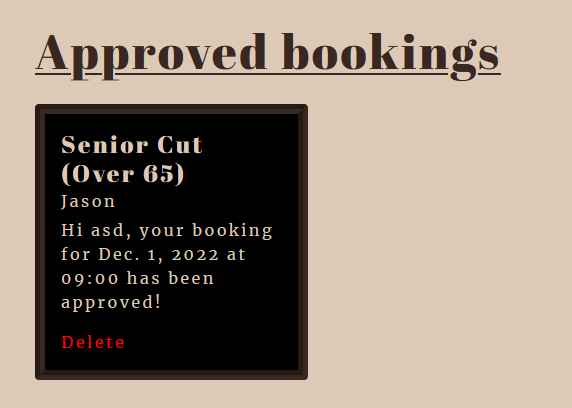

# BARBER

## Purpose of the project
purpose of the project is to build a Full-Stack site based on business logic used to control a centrally owned dataset. The project has an authentication mechanism and provides role-based access to the site's data or other activities based on the dataset.

The barber shop uses a database to build a booking logic for a business that needs to control datasets of customers' booking information. Both the customer and admin can Create, Read, Update and Delete these datasets.

## User Stories
### 1) Visiting User
- As a visiting user, I want to be able to find out information such as opening times, addresses, and services provided by the business.
- As a visiting user, I want to be able to register on the site for bookings.
- As a visiting user, I want to be able to contact the business. 

### 2) Registered User
- As a registered user, I want to be able to book a chosen service at a desired time and date and with my chosen barber.
- As a registered user, I want to be able to view my bookings and know if they have been approved.
- As a registered user, I want to be able to edit my bookings in case of wrong input or change of availability.
- As a registered user, I want to be able to delete my bookings.

### 3) Admin
- As an admin, I want to be able to create new bookings on the system.
- As an admin, I want to be able to view every user's bookings and the details of the booking.
- As an admin, I want to be able to edit customers' information if need be.
- As an admin, I want to be able to delete bookings.
- As an admin, I want to be able to view customers' queries and their contact information. 

## Features
### Header/Nav-bar
- The navbar is a feature that is on every page, it consists of 4 links and the Barber name. Home and Barber are both linked to index.html, and Service and Contact us have linked accordingly with their IDs so when clicked they scroll down to the representative section on the index.html. 4th link is the log in which takes you to the login page.
- For the unregistered user the navbar consists of 4 links, whereas if you're registered it consists of an extra Booking link, and a My booking link, and instead of a login link, there's, a logout link.

- When links are hovered over they turn dark green for the user to recognise they are hovering over the link. 
 
- The navbar is responsive and when the width size decreases the navbar toggles a burger button, which when pressed shows a list of the links.

### Picture Carousel
- The home page has a picture carousel with 3 images, it changes the pictures by itself, but in addition, it has buttons for the user to change pictures.

### Information and Google maps
- Under the picture carousel there's a little section with the key business details such as where to find us, how to get in touch, and opening times.
- Besides all this information there's an iframe of google maps and pinpointed location where the barber shop is located.

### Service's provided by the Barbershop 
- The services that the business provides are presented in cards with pictures of the service accompanied by a title and price
- At the bottom of the service section, there's a book button. however, if the user is not signed in that book button is a log-in button.

### Contact us
- The contact details are highlighted in the details area, however, at the bottom of the home page there's a form for any user to fill out with their query 
- The form requires a Name, Surname, Email, and Query, if these are not filled out then the form cannot be submitted.

### Footer
- Footer is on every page, with simple social media icons that lead to representative social media.

### Login/Register/logout
- The login/register/logout form has been provided by the Django-all auth add-on, they are presented on the page in a minimalistic form.

### Booking page
- The booking page is a simple booking form for the user to fill out, once filled out and all required fields are filled out the submission will take the user to their booking page.

### My bookings
- My bookings page consists of two sections the Approved booking section and the Pending bookings section 
- Approved bookings only show in approve section once Admin approves the pending booking

- Pending booking show straight after a booking is made

- Bookings are presented in a card form with details such as date of booking, time, barber, and service. 
- Pending bookings can delete a booking and edit a booking, whereas accepted bookings only have the ability to cancel a booking.

### Edit and Delete
- Edit button only shows on pending cards, when clicked it directs you to another page with a pre-propulated form, user can change whatever detail they want. 
- The edit page has an update button that changes the form and shows it on my bookings cards and it also has a go-back button that will not edit the cards.
- Delete shows on both pending and approved bookings works similarly to edit, goes to another page, but instead of a form, you have a question asking if you're sure you want to delete.

## Future Features
Future implementations
- Once a user books a date and time, that date and time then are taken away from the database so no other user can take the same date and time - automated approval - right now the approval is done by admin.
- After booking user can pay for the service in advance if he wants to.
- Sell barber products on the Barbershop webpage.

## Wireframes And Further Planning
### Wireframes
- [Home page](./static/assets/images/readme/wireframe1.PNG) For the front page, not much has changed during the production from the original idea.
- [Booking page](./static/assets/images/readme/wireframe2.PNG)
### Flowchart
- I've also created a [Flowchart](./static/assets/images/readme/flowchart.PNG) to plan all the scenarios that should that place with every process/function and with every choice the user takes. The final project follows this chart very well.

## Testing

- I have tested this site for responsiveness by opening the webpage on different devices such as my desktop and my phone, as well as using the built-in dev tools.
- I have ensured to go other every form checking every field that required input to be put in, that the forms send and direct to the right page after as well as, checked the CRUD functionality.

### Python
- I have tested the code by using [PEP8 online check](https://infoheap.com/python-lint-online/). All python files came back with no issues.
- Also used Black as an add-on that formats my python code.

### HTML 
- Tested all templated using [HTML Validator](https://validator.w3.org/nu/). Every template returns good

### CSS
- Tested all CSS using [CSS Validator](https://jigsaw.w3.org/css-validator/)

### Accessibility test
- I have done an accessibility test via an add-on lighthouse

### Automated tests
- Also within the app I have created tests for forms that ensure all fields are required and will be failing if the user does not input required information
- Created tests for models to ensure every object within models works correctly.

## Fixed bug
- My first login attempt was via an email confirmation, after working that way every time a user tried login in the email came back as invalid even after tweaking the setting and setting everything to email verification. to sort this bug I changed back to username verification. 

## Technologies 
- Python - Django and all the add-ons Django has to offer such as forms, allauth, black, etc.
- HTML
- CSS 
- JavaScript

## Agile
- Creating a project page within this App's GitHub repository allowed me to use its Agile methodology tools, where I was able to group user stories into different categories of 'To do', 'In Progress', and 'Completed'. This helped keep track of what to work on.

## Deployment 
### Heroku
- This app was deployed using the [Django Blog Cheat Sheet](https://codeinstitute.s3.amazonaws.com/fst/Django%20Blog%20Cheat%20Sheet%20v1.pdf)

### Gitpod
- Site is deployed on Gitpod by:
        - Download the Gitpod extension for your browser so the code opens in the browser.
        - Going to the site's dedicated repository.
        - Above the commits, there's a green button with 'Gitpod'
        - By clicking that, Gitpod will open its code creator site
        - In Gitpod we go to the terminal and type in 'python3 -m HTTP.server'
        - 
        A pop-up will open, press preview and the website will deploy.

## Credits
- [Codemy.com](https://www.youtube.com/@Codemycom) on youtube, tutorials helped with creations of CRUD functionality
- Stackoverflow was used as a good platform for solving any code problems I have encountered
- Barbershop has some of Codeinstitute's 'I think therefore I blog' projects code implemented into its code

## Media 
- Images used were used from Google images for educational purposes only.